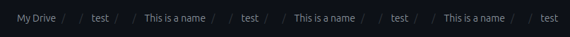
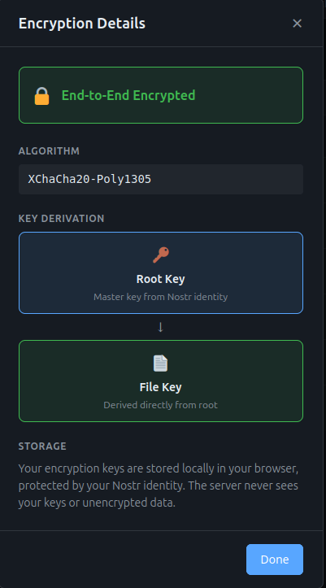

# Cloistr Stash - Manual Testing Checklist

Comprehensive UI testing checklist for stash.cloistr.xyz

**Last Updated:** 2026-03-21 (v37)

## Recent Fixes (Re-test These)

### Session: 2026-03-21
- [X] X button in search: now white→red (dark) / black→red (light)
- [ ] 3-dot menu (⋮) replaces download+delete buttons - opens full context menu
- [ ] Context menu positioning - no longer renders off-screen
- [ ] Download button alignment in file info modal - icon/text aligned
- [ ] "..." file no longer appears (root-key filter added)
- [X] Gap between Modified column and action buttons closed
- [X] Filter button (⧩) visible and functional

### Session: 2026-03-20
- [X] Relay settings save correctly (auth-required fix)
- [X] Filter button larger with tooltip
- [X] File info modal when clicking filename
- [X] Starred/Recent/Trash views now show correct content (was showing "No shared files")

---

## Pre-Test Setup

- [X] Clear browser cache and service worker (DevTools > Application > Storage > Clear site data)
- [X] Have a Nostr browser extension installed (nos2x, Alby, etc.) OR
- [X] Have a bunker URL ready from signer.cloistr.xyz
- [X] Prepare test files: small image, large file (>10MB), text file, PDF, code file

---

## 1. Authentication

### NIP-07 (Browser Extension)
- [X] Landing page displays correctly with features and connect buttons
- [X] Click "Connect with Extension" prompts extension approval
- [X] After approval, redirects to file explorer
- [X] User pubkey displays in header (truncated npub)
- [ ] Session persists after page refresh
  - This works with remote signer, but not with extension

### NIP-46 (Remote Signer)
- [X] Click "Connect with Remote Signer" opens modal
- [X] Modal has bunker URL input field
- [X] Invalid URL shows error toast
- [X] Valid bunker URL initiates connection
- [X] Connection status spinner displays during connect
- [X] Successful connection redirects to file explorer
- [X] Session persists after page refresh
  - We did get our first `NIP-46: Failed to restore session: Error: Session restore timed out
    timeoutPromise https://stash.cloistr.xyz/js/nip46.js:1410` in days. Appears to be a damus issue though, which we'll likely remove soon.

### Session Management
- [X] Disconnect button logs out and returns to landing page
- [X] After disconnect, session is cleared (refresh stays on landing)
- [ ] Connecting with different identity shows different files
  - Can't verify this as we need to whitelist a second account

### Access Control
- [X] Unauthorized pubkey shows "Access Denied" screen
- [X] Denied pubkey is displayed on screen
- [X] Disconnect button works from denied screen

---

## 2. File Upload

### Basic Upload
- [X] Click Upload button opens upload modal
- [X] Click drop zone opens file picker
- [X] Selecting file(s) shows them in upload list
- [X] Each file shows name, size, and status
- [X] Upload button enables when files selected
- [X] Progress bar shows during upload
- [X] Success toast after upload completes
- [X] File appears in file list after upload

### Drag and Drop
- [X] Dragging file over page shows drop overlay
- [X] Drop overlay has correct styling and text
- [ ] Dropping file opens upload modal with file pre-populated
  - Dropping file just starts uploading
- [ ] Dropping multiple files adds all to upload list
  - Same behavior, dropping just starts the upload
- [ ] Dragging away hides drop overlay
  - Without refreshing the page or uploading, there doesn't appear to be a way to make the overlay hide again
- [X] Drag-drop works on file list area (outside modal)

### Large Files
- [ ] File >10MB uses chunked encryption (check console for chunk logs)
  - Large files (22MB) upload, but I see no console logs for it, can't verify chunking.
- [ ] Progress updates during large file upload
  - We get the same progress bar as any other single file, 0% directly to 100% completion
- [X] Upload completes successfully

### Duplicate Detection
- [ ] Uploading same file twice shows deduplication message
  - No deduplication message is shown
- [X] File is not re-uploaded (instant completion)

### Upload Errors
- [X] Cancel button closes modal without uploading
- [ ] Network error shows appropriate error toast
  - Not sure how to verify
- [ ] Partial upload failure shows which files failed
  - Not sure how to force a breakage to verify

---

## 3. File Operations

**Note:** File list now uses 3-dot menu (⋮) instead of inline download/delete buttons. Click ⋮ to access all file actions via context menu. Clicking filename opens file info modal.

### Download
- [ ] Click ⋮ menu → Download downloads file
  - This does work, technically. If I reload the page, however, and try to access files previously uploaded, I get `Preview failed: Decryption failed: invalid key or corrupted data`
- [X] Downloaded file matches original (verify content)
- [X] Encrypted files decrypt correctly on download
- [X] Large files download completely

### Delete
- [X] Click ⋮ menu → Delete shows confirmation (or right-click → Delete)
- [X] Confirming moves file to trash
- [X] Toast confirms deletion
- [X] File disappears from list
- [ ] File appears in Trash view
  - I can see the history in `Activity`, but the trash remains empty.
  - `Starred`, `Recent`, and `Trash` links all say `No shared files`. Seems like a bug.

### Rename
- [ ] Right-click OR ⋮ menu shows context menu with Rename option
  - **Updated 2026-03-21:** Context menu now includes Rename
- [ ] Rename prompts for new name
- [ ] New name appears in file list
- [ ] Invalid names are rejected

### File Info Modal
- [ ] Clicking filename opens file info modal with metadata
  - **Added 2026-03-20:** Shows Size, Type, Modified, Encrypted status, SHA256
- [ ] Modal has action buttons: Preview, Download, Share, Public Link, History, Delete
- [ ] Download button icon/text properly aligned
  - **Fixed 2026-03-21:** Now uses inline-flex for alignment

### File Preview
- [ ] Clicking Preview button (or double-click) shows preview
  - Same as file downloads; this does work, but we get the same error when we refresh the page.
- [ ] Clicking text file opens in editor
  - We can view text files, but editor errors: `Error: awarenessProtocol is not defined`
- [X] PDF files can be viewed/downloaded

---

## 4. Folder Operations

### Create Folder
- [X] Click "New Folder" button prompts for name
- [X] Folder appears in file list
- [X] Folder appears in sidebar tree
- [X] Empty name is rejected

### Navigate Folders
- [X] Clicking folder opens it
- [X] Breadcrumb updates to show path
- [X] Clicking breadcrumb item navigates to that level
- [X] Root breadcrumb returns to My Drive
- [X] Sidebar tree expands to show subfolders
- Breadcrumbs get weird as you jump around using the sidebar tree, though navigating to root clears the breadcrumbs regardless. Also, the double `/` is a bit offputting. See below:

### Delete Folder
- [X] Right-click folder shows delete option
- [X] Deleting empty folder succeeds
  - Feedback would be helpful with this. When I click delete, I have no idea if it's working or not.
- [X] Deleting folder with contents prompts confirmation
  - Says `contents will be moved to root`, will need to address once we fix files within folders.
- [X] Deleted folder removed from list and sidebar

### Move Files to Folder
- [ ] Drag file onto folder moves file
  - The UI toast claims it's moving and that it happened successfully, no files to be found. This is also true for uploading new files into a folder though, so could be a separate issue than moving
- [ ] File disappears from current location
  - Can't test
- [ ] File appears in target folder
  - They do not, see previous comment
- [X] Toast confirms move

### Customize Folder
- [X] Right-click folder shows "Customize" option
- [X] Color picker displays available colors
- [X] Icon picker displays available icons
- [ ] Selecting color/icon updates folder appearance
  - We get an error when saving: ` SES_UNCAUGHT_EXCEPTION: TypeError: this.refreshFileList is not a function`
- [ ] Reset button restores defaults
  - Also returns: ` SES_UNCAUGHT_EXCEPTION: TypeError: this.refreshFileList is not a function`
- [ ] Changes persist after page refresh
  - Can't test

---

## 5. Encryption & Security

### Encryption Verification
- [X] Uploaded files show E2E badge
- [ ] Click E2E badge opens encryption info modal
  - No modal
- [ ] Modal shows algorithm (XChaCha20-Poly1305)
  - I can see that info when I right click -> `Encryption Info`:
  - 
- [X] Modal shows key hierarchy

### Key Backup
- [X] Click key backup icon in header
- [X] Export Keys downloads .json file
- [X] Import Keys accepts backup file
- [ ] After import, can decrypt files encrypted with those keys
  - Unsure how to test

### Key Hierarchy
- [ ] Root folder uses root key derivation
- [ ] Subfolders use folder-specific keys
- [ ] Files in folders use file-specific keys

- Unsure how to test any of this

---

## 6. Sharing

### Share with Nostr User
- [ ] Click share button on file
- [ ] Share modal opens with recipient input
- [ ] Enter valid npub or hex pubkey
- [ ] Optional message can be added
- [ ] Confirm creates share
- [ ] Toast confirms share sent
- [ ] Recipient sees file in "Shared with Me" tab

### Public Links
- [ ] Click "Public Link" in file menu
- [ ] Modal shows expiration options
- [ ] Generate creates URL
- [ ] URL can be copied
- [ ] Opening URL in incognito allows download
- [ ] File decrypts correctly from public link
- [ ] Expired links stop working (test with 1 hour expiry)

### Manage Shares
- [ ] Click "Manage Shares" shows existing shares
- [ ] Can see who file is shared with
- [ ] Re-encrypt button revokes all access
- [ ] After re-encrypt, old shares stop working

### Shared with Me
- [ ] Tab shows files others shared with you
- [ ] Files can be downloaded
- [ ] Files decrypt correctly

---

## 7. Search & Filtering

### Basic Search
- [X] Search box visible in toolbar
- [X] Typing filters file list
  - Does this also search file text? I searched `test` and got the file `Cryptography Theory and Practice (4th Ed)(gnv64).pdf` and I can only assume that's why it would have populated.
- [X] Matches found by filename
- [X] Clear button (✕) resets search
  - **Updated 2026-03-21:** X now larger, white→red hover (dark) / black→red hover (light)
- [X] No results shows appropriate message

### Search Filters
- [ ] Click filter button (⧩) shows filter panel
- [ ] File type filter works (Images, Videos, etc.)
- [ ] Date filter works (Today, This Week, etc.)
- [ ] Size filter works (Tiny, Small, etc.)
- [ ] Multiple filters combine correctly
- [ ] Reset clears all filters
- **Updated 2026-03-21:** Filter button now visible with ⧩ icon and tooltip

### Encrypted Search
- [X] Search works for file contents (text files)
  - I believe this is what I saw and questioned in `Basic Search` section
- [ ] Search index builds after upload (check console)
  - I'm not sure what I'm looking for on this one

---

## 8. Views & Navigation

### My Files
- [X] Default view shows all files
  - If this means that I should even see files within folders, I do not. But that doesn't really make sense and I assume that I should see folders and not the files inside them, so I'm marking this as functional.
- [X] Folders and files both display
- [X] Sort dropdown changes order
- [X] Grid view button switches to grid
  - Grid goes straight down, no padding. I would expect it to read left to right, then start to expand downwards, and would expect padding between icons.
- [X] List view button switches to list

### Starred
- [X] Click star button on file stars it
- [X] Starred files show filled star
- [ ] Starred nav item shows starred files
  - **Fixed 2026-03-20:** No longer shows "No shared files"
- [ ] Unstarring removes from starred view

### Recent
- [ ] Recent nav item shows recently accessed files
  - **Fixed 2026-03-20:** No longer shows "No shared files"
- [ ] Opening/downloading file adds it to recent
- [ ] Recent list is ordered by access time

### Trash
- [ ] Trash nav item shows deleted files
  - **Fixed 2026-03-20:** No longer shows "No shared files"
- [ ] Badge shows trash count
- [ ] Can restore files from trash
- [ ] Can permanently delete from trash
- [ ] 30-day auto-purge warning displayed

### Activity Log
- [X] Activity nav item opens modal
- [X] Shows upload, download, delete, share activities
- [X] Filter dropdown filters by activity type
- [X] Clear History button clears log

### Notifications
- [X] Notification nav item opens modal
- [ ] Share notifications appear
- [ ] Accept/Decline buttons work
- [ ] Badge shows unread count
- [ ] Mark All Read clears badge
  - Need second account whitelisted to test these.

---

## 9. File Features

### Thumbnails
- [X] Image files show thumbnail preview
- [X] Thumbnails load asynchronously
- [X] Non-image files show generic icon
  - A single `lock` icon seems a bit offputting. What about a paper icon if we're only going to use a single icon? Ideally, we could use several icons based on filetype, though I'm not sure how much overhead that might add.

### Version History
- [ ] Upload new version of existing file
  - Uploads a second, third, etc file with same name
- [ ] Click history button shows versions
  - `No version history available` because files are not updated
- [ ] Can download previous versions
  - See above
- [ ] Can restore previous versions
  - See above

### Comments
- [X] Click comments button opens modal
- [X] Can add comment to file
- [ ] Comments persist after refresh
- [ ] Can delete own comments
- Should access to this exist anywhere besides the right click context?

### Tags
- [X] Click tags button opens modal
- [ ] Can add tag to file
- [ ] Tag suggestions appear
- [ ] Can remove tags
- [ ] Can filter by tag

---

## 10. Collaboration

### Text Editor
- [ ] Double-click text file opens editor
- [ ] Content loads in textarea
- [ ] Edit content and save
- [ ] Changes persist after close

### Real-time Collaboration
- [ ] Click Invite in editor
- [ ] Enter collaborator pubkey
- [ ] Second user can open same file
- [ ] Edits sync between users in real-time
- [ ] Collaborator indicators show who's editing
- [ ] Conflict resolution works (CRDT)

---

## 11. Settings

### Relay Settings
- [X] Click relay icon opens settings
- [X] Current relays listed with read/write indicators
- [ ] Can add new relay URL
  - This fails with `Please enter a relay URL`. Sometimes the relay still shows in the `Your data is published to these relays:` section, but then after a save, it disappears. My only test was `wss://relay.damus.io`. I don't believe they support blossom, so maybe that's why? If that's the only reason, then perhaps a different warning/indication for that.
- [ ] Can remove relay
  - Can't test without second relay
- [X] Can toggle read/write per relay
  - **Fixed 2026-03-20:** Toggle constraint removed, both can now be off (disables relay)
- [X] Save persists changes
  - **Fixed 2026-03-20:** Now uses authenticated relay connection
- [ ] Changes take effect on next publish

### Theme
- [X] Click theme toggle switches dark/light
- [X] Preference persists after refresh
- Light mode bulk `Delete` button is unreadable.

---

## 12. Batch Operations

### Selection
- [ ] Ctrl+click selects multiple files
  - Cannot select files unless I use the checkboxes
- [ ] Shift+click selects range
  - Cannot select files unless I use the checkboxes
- [X] Select all checkbox works
  - It works, but only appears once a first file is selected. Should be there from the start
- [X] Batch toolbar appears when files selected

### Batch Actions
- [X] Batch download downloads all selected
  - Other services download a single zip instead of individual files; should we follow that pattern or stick with what we have?
- [X] Batch delete prompts confirmation
- [ ] Batch delete moves all to trash
  - Activity suggests yes, but as stated above, we can't check trash currently.
- [X] Cancel clears selection

---

## 13. Keyboard Shortcuts

- [ ] `?` shows keyboard shortcuts help
- [ ] `u` opens upload modal
- [ ] `n` opens new folder prompt
- [ ] `/` focuses search
- [ ] `Escape` closes modals
- [ ] `Delete` deletes selected file(s)
- [ ] Arrow keys navigate file list
- [ ] Enter opens selected folder/file
- None of these work. Arguably the arrow keys, but they only navigate up/down through checkboxes.

---

## 14. Responsive & Mobile

### Tablet (768px)
- [ ] Layout adapts appropriately
- [ ] Sidebar can be toggled
- [ ] All functionality accessible

### Mobile (375px)
- [ ] Mobile menu button appears
- [ ] Sidebar is hidden by default
- [ ] Sidebar slides in on menu tap
- [ ] Touch gestures work
- [ ] Upload works
- [ ] Files can be downloaded
- [ ] Modals are scrollable

---

## 15. Offline & PWA

### Offline Mode
- [ ] Disconnect network
- [ ] Offline banner appears
- [ ] Cached files remain visible
- [ ] Attempting upload shows offline warning
- [ ] Reconnect restores functionality

### PWA Install
- [ ] Install prompt appears (or manual install)
- [ ] Installed app opens standalone
- [ ] App icon correct

---

## 16. Error Handling

### Network Errors
- [ ] Server down shows error state
- [ ] Retry button appears
- [ ] Reconnection works

### Upload Errors
- [ ] File too large shows error
- [ ] Unsupported operation shows error

### Auth Errors
- [ ] Session timeout handled gracefully
- [ ] Re-authentication prompts work

---

## 17. Accessibility

### Screen Reader
- [ ] All interactive elements have labels
- [ ] Modal focus is trapped
- [ ] Focus returns after modal close

### Keyboard Navigation
- [ ] Tab order is logical
- [ ] All controls keyboard accessible
- [ ] Focus indicators visible

---

## Post-Test

- [ ] Check browser console for errors
- [ ] Note any UI inconsistencies
- [ ] Document reproduction steps for issues found
